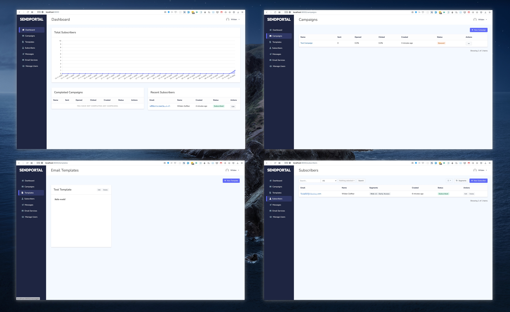
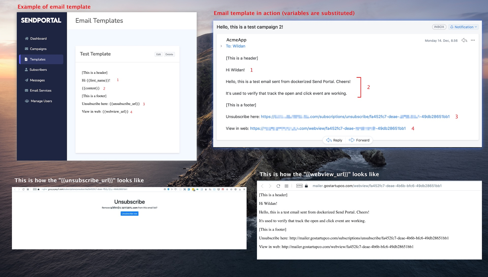

<h1 align="center">Docker SendPortal</h1>

This repo contains the dockerized version of [SendPortal](https://github.com/mettle/sendportal), an open-source self-hosted email marketing. The docker flow is opinionated but you can use it as reference to make something of your own. All docker-related files are stored inside `docker` directory.

To start the setup:

1. Make sure you have docker installed. Check docker documentation if you haven't: https://docs.docker.com/engine/install/
2. Create a `.env` file based on `.env.sample`. Adjust the content of your `.env` according to your need.
3. Run the script: `./run.sh`

The script will use environment variables from `.env` and builds a docker image called `sendportal` based on `docker/Dockerfile`. It will also run a redis and nginx container, namely `sendportal_redis` and `sendportal_nginx`. Lastly, the script will trigger the sendportal setup command using `artisan sp:setup` which asks for few details like domain name, database informations (if not provided yet), etc.

Once completed, you can access your SendPortal at http://localhost:9000.

Here's some screenshots of SendPortal running in localhost using docker:

### 1. Why SendPortal?

- The interface is clean
- The workflow is not so complicated; create campaign, send campaign, monitor campaign, repeat
- Good alternative if you want a DIY solution and cheaper to mailchimp
- It's open-source!

### 2. Why dockerizing it?

- You just want to quickly run the tool
- You don't want to deal with setting up the dependencies
- You want a flow that can be easily replicated

### 3. Why run.sh?

- It's easier for me because I can just arrange the commands based on my need (hey, it's opinionated!)
- I don't have to install docker-compose
- It works out of the box on most platforms (ubuntu, macOS, or Windows via Git Bash or WSL)

### 4. Is there any alternative to SendPortal?

- I tried [Mailtrain](https://github.com/Mailtrain-org/mailtrain) but the flow is a bit confusing to me. And it seems to send queued emails at a slower rate (I once scheduled ~10k emails and it took 1 hour to finish).
- I checked [phplist](https://github.com/phpList/phplist3) but the UI seems too crowded for me.

### 5. Where can I learn more about SendPortal features?

- You can start from its official documentation: https://sendportal.io/docs/features/subscribers
- If you want to know more about what kind of content you can put in your campaign email (eg. can you automatically insert your subscriber name?), check this **Templates** section: https://sendportal.io/docs/features/templates
- Finally, you can also check their Github issues at https://github.com/mettle/sendportal/issues to see what bugs are being solved, feature requests, etc.

### 6. Do you have a demo?

- Yes! It's here: https://sendportaldemo.wzulfikar.com
  - user: delpha.cronin@ethereal.email
  - password: `demo1234`
- If you want to see the emails that are sent by the demo app, check the mailbox too:
  - mailbox url: https://ethereal.email/messages
  - user: delpha.cronin@ethereal.email
  - password: `rxg88vKsXfZ6pH7dea`
- You can also check the Laravel Horizon that's is bundled by SendPortal. To do so, login to the demo site and go to https://sendportaldemo.wzulfikar.com/horizon

That's it. Hope it helps!
